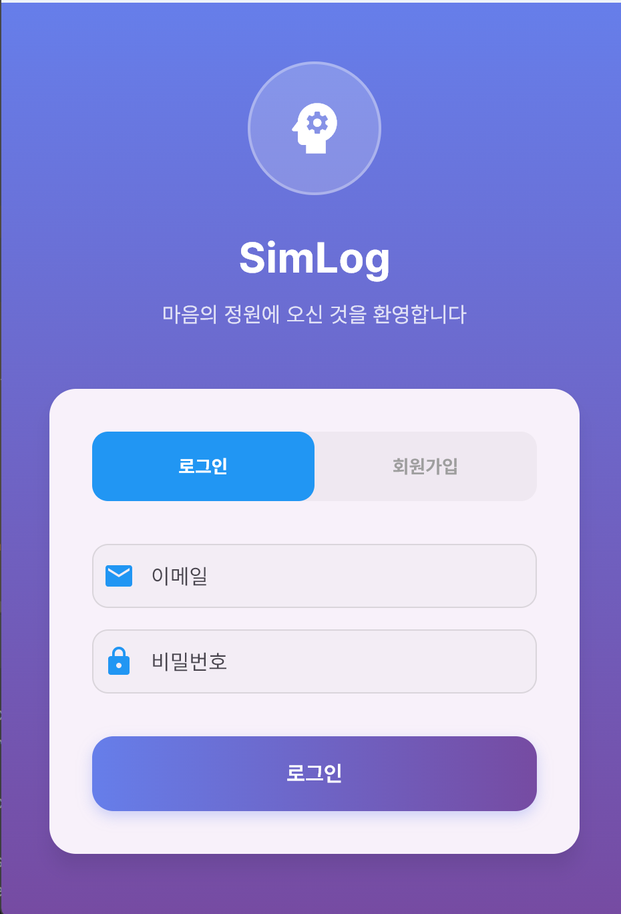
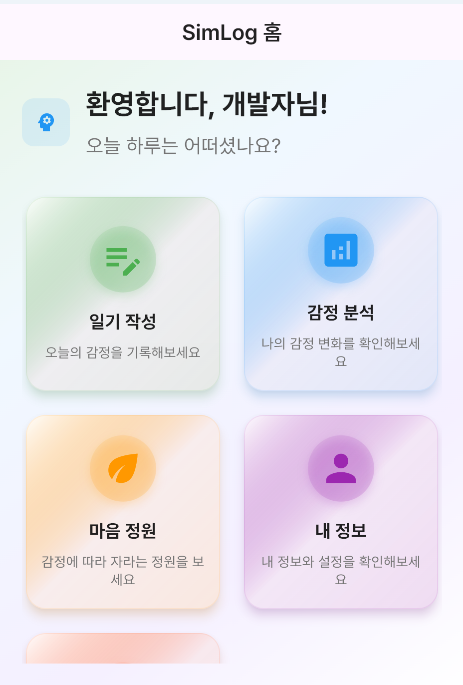
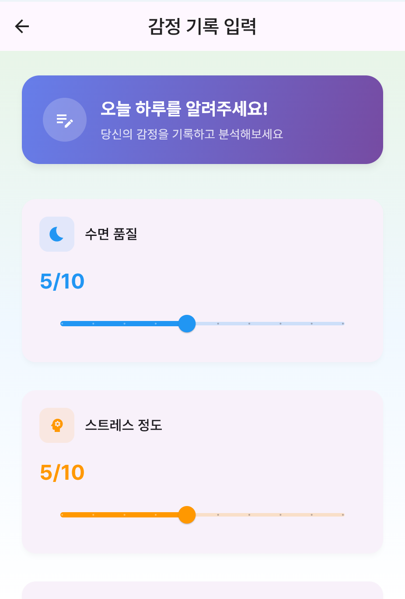
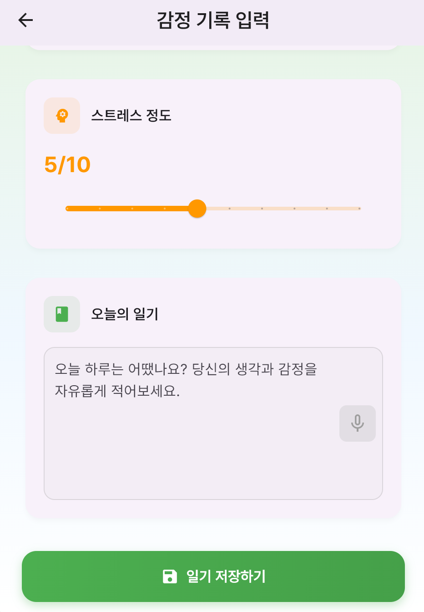
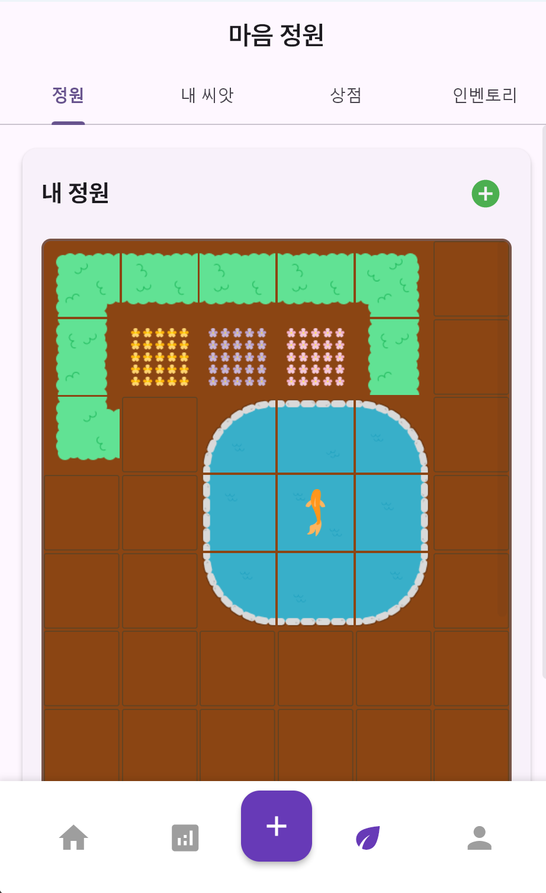
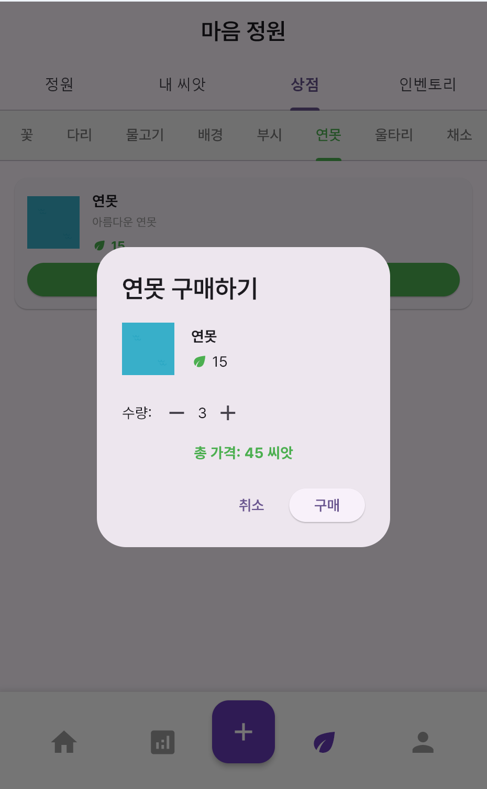
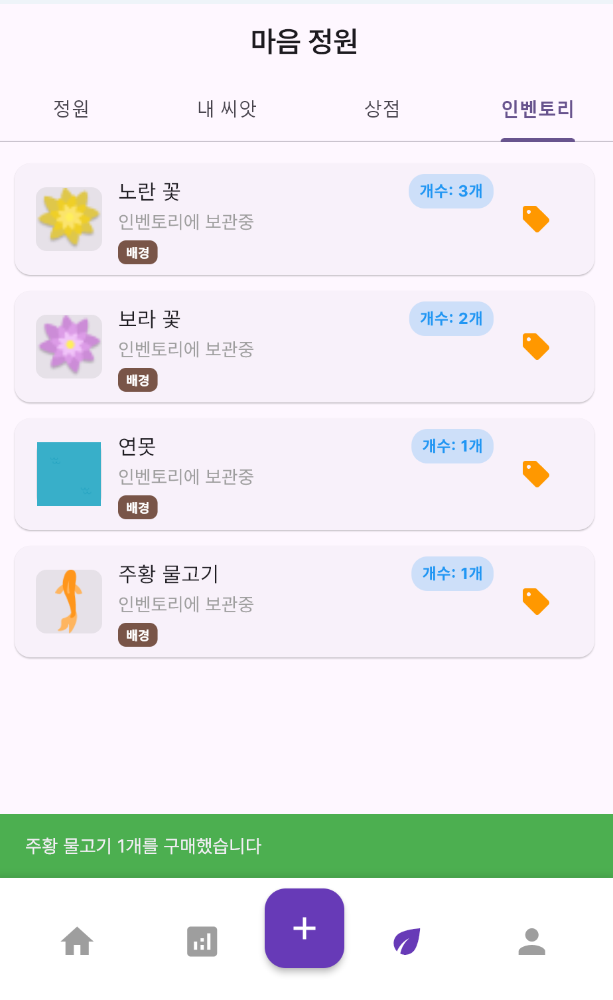

# SimLog (심로그) 🌸

**심리 감정 기록 및 AI 분석 플랫폼**

감정 표현이 서툰 청년층을 위한 비대면·비실명 감정 기록 및 AI 기반 피드백 시스템

---

## 📱 프로젝트 소개

SimLog는 AI 기반 감정 분석과 마음 건강 관리를 위한 모바일 애플리케이션입니다. 사용자의 일기 내용을 분석하여 감정 상태를 파악하고, 필요시 전문가 상담을 연결하는 서비스입니다.

---

## 🎥 시연 영상

<div align="center">

[](https://youtube.com/shorts/6Zve5oCCCCk?feature=share)

**SimLog 어플 시연 영상** - [YouTube Shorts로 보기](https://youtube.com/shorts/6Zve5oCCCCk?feature=share)

</div>

---

 

## 🧭 시스템 아키텍처

<div align="center">


</div>

## 📊 데이터 흐름도

<div align="center">


</div>

---

## 🏗️ 기술 스택

### Backend

- **Framework**: FastAPI 0.115.13 (Python)
- **Database**: MySQL 8.0 (Railway)
- **ORM**: SQLAlchemy 2.0.0
- **Authentication**: JWT (JSON Web Token)
- **AI Service**: OpenAI GPT-4o mini, Naver Clova STT
- **Deployment**: Railway
- **Environment**: Python 3.8+
- **Package Manager**: pip (Python), pub (Dart)

### Frontend

- **Framework**: Flutter 3.16.5 (Dart 3.2.3)
- **Platform**: Android, iOS, Web
- **State Management**: Flutter 기본 상태 관리
- **HTTP Client**: http package
- **URL Launcher**: url_launcher package
- **Build**: Flutter CLI

### AI & External Services

- **Emotion Analysis**: OpenAI GPT-4o mini
- **Speech To Text**: Naver Clova STT
- **Fallback Analysis**: Keyword-based emotion classification
- **Form Service**: Google Forms
- **Cloud Platform**: Railway (Backend + Database)

### Development Tools

- **Version Control**: Git
- **API Testing**: Postman
- **Code Editor**: VS Code / Cursor
- **Package Management**: pip (Python), pub (Dart)

### Platform Requirements

- **Android**: Android SDK 지원
- **iOS**: iOS 지원
- **Java**: Java 개발 환경
- **Gradle**: Android 빌드 도구


## 🚀 핵심 기능

### 1. 사용자 인증 및 관리

- **JWT 기반 인증**: 보안된 API 접근
- **사용자 프로필**: 닉네임, 이메일, 개발자 권한 관리
- **세션 관리**: 자동 로그인 및 토큰 갱신

### 2. AI 감정 분석 시스템

- **GPT-4o mini 기반 분석**:
    - 감정 분류 (Robert Plutchik's Wheel of Emotions)
      - 
    - 텍스트 요약
    - 키워드 추출
- **Fallback 메커니즘**: AI API 실패 시 키워드 기반 분석
- **감정 색상 매핑**: 감정별 고유 색상 및 강도 표현
- **신뢰도 점수**: AI 분석 결과의 신뢰성 표시

### 3. 일기 작성 및 관리

- **일기 작성**: 텍스트 기반 일기 입력
- **감정 분석 결과**: AI 분석 후 시각적 피드백
- **감정 색상**: 감정 상태를 색상으로 표현 (로버트 플루치크 - 감정의 바퀴 기반)
- **일기 히스토리**: 과거 일기 조회 및 관리

### 4. 마음 건강 모니터링

- **7일 감정 추이**: 일주일간의 감정 상태 분석
- **부정 감정 알림**: 지속적인 부정 감정 시 사용자 알림
- **상담 연결**: 전문가 상담 폼으로 연결
- **자동 억제**: 알림 확인 후 7일간 재알림 억제

### 5. 공유 및 리포트

- **주간 요약 공유**: 7일간의 감정 상태 요약 링크 생성
- **상담사 공유**: 전문가와 공유 가능한 요약 리포트
- **링크 만료**: 7일 후 자동 만료되는 보안 링크
- **공유 통계**: 감정 변화 추이 및 패턴 분석

### 6. 마음 체크하기

- **외부 폼 연결**: Google Forms 기반 상담 신청
- **링크 생성**: 개인별 상담 신청 링크
- **브라우저 연동**: 외부 브라우저 또는 앱 내 웹뷰 지원
- **크로스 플랫폼**: Android, iOS 모두 지원

### 7. 마음 정원

- **게이미피케이션 요소**: 지속적인 사용을 장려하기 위해 '씨앗' 이라는 화폐를 사용하는 정원 꾸미기 시스템
- **연속 출석 보상**: 지속적 사용 장려
- **인벤토리, 상점, 여러가지 에셋**: 사용자 본인만의 정원을 꾸미기 가능
- **성취 시스템**: 일기 작성, 감정 분석 완료 등 다양한 활동에 대한 보상
- **정원 커스터마이징**: 꽃, 나무, 장식품 등으로 개인화된 정원 구성

### 8. 개발자 기능

- **테스트 알림**: 개발자 계정 전용 7일 알림 테스트
- **강제 알림 표시**: 개발 및 테스트를 위한 알림 모달 강제 표시
- **디버그 모드**: API 상태 및 AI 분석 결과 확인

---

## 🔧 기술적 특징

### AI 분석 시스템

- **멀티 레벨 분석**: AI → 키워드 → 템플릿 순차적 fallback
- **감정 분류 정확도**: 8가지 기본 감정 + 강도별 세분화
- **컨텍스트 인식**: 문맥을 고려한 감정 분석
- **에러 핸들링**: API 실패 시에도 안정적인 분석 제공

### 보안 및 프라이버시

- **JWT 인증**: 안전한 사용자 인증
- **링크 만료**: 시간 제한이 있는 공유 링크
- **데이터 암호화**: 민감한 사용자 정보 보호
- **권한 기반 접근**: 개발자 기능은 개발자 계정만 접근

### 크로스 플랫폼 지원

- **Android**: 네이티브 Android 앱
- **iOS**: 네이티브 iOS 앱
- **Web**: Flutter Web 지원
- **반응형 UI**: 다양한 화면 크기에 최적화

### 성능 최적화

- **비동기 처리**: API 호출 및 데이터 처리
- **캐싱**: 사용자 정보 및 설정 캐싱
- **로딩 상태**: 사용자 경험 향상을 위한 로딩 표시
- **에러 복구**: 네트워크 오류 시 자동 재시도

---

## 📸 앱 스크린샷

### 🔐 로그인 및 홈 화면
<div align="center">




</div>
*JWT 기반 보안 로그인과 직관적인 홈 화면. 일기 작성, 감정 분석, 마음 정원, 내 정보로의 빠른 접근을 제공합니다.*

### 📝 일기 작성 및 감정 분석
<div align="center">




</div>
*AI 기반 감정 분석으로 일기 내용을 실시간 분석하여 감정 색상과 키워드를 제공합니다. 7일, 14일, 30일간의 감정 변화 추이를 시각적으로 확인할 수 있습니다.*

### 🌱 마음 정원 시스템
<div align="center">




</div>
*게이미피케이션을 통한 지속적 사용 장려. 출석 체크로 씨앗을 모아 정원을 꾸미고, 상점에서 다양한 아이템을 구매하여 개인화된 정원을 만들 수 있습니다.*

### 🧠 마음 건강 관리
<div align="center">


</div>
*지속적인 부정 감정 감지 시 상담 연결을 제안하고, 7일 요약을 생성하여 전문가와 공유할 수 있습니다. 상담사와의 원활한 소통을 지원합니다.*

---

## 📊 데이터 구조

### 🗄️ 주요 테이블

| 테이블 | 주요 필드 | 설명 |
|--------|-----------|------|
| **users** | `id`, `email`, `nickname`, `seeds`, `is_developer` | 사용자 정보, 씨앗(화폐), 개발자 권한 |
| **records** | `content`, `emotion_analysis`, `ai_keywords`, `ai_summary` | 일기 내용, AI 감정 분석 결과 |
| **garden_items** | `item_type`, `item_name`, `position_x/y`, `is_equipped` | 정원 아이템, 위치, 배치 상태 |
| **garden_item_templates** | `item_name`, `price`, `rarity`, `is_available` | 상점 아이템 템플릿 |
| **shared_reports** | `token_digest`, `snapshot`, `expires_at` | 7일 요약 공유 링크 |
| **weekly_summary_cache** | `period_days`, `items`, `negative_ratio` | 주간/월간 요약 캐시 |
| **user_alert_state** | `last_mind_check_at` | 알림 상태 관리 |
| **user_consents** | `consented`, `consented_at` | 상담사 공유 동의 |

### 🎨 AI 감정 분석 응답

```json
{
  "primary_emotion": "슬픔",
  "intensity": 8,
  "confidence": 0.95,
  "reasoning": "텍스트에서 '힘들었다', '죽고싶다' 표현이 깊은 슬픔과 절망감을 나타냄",
  "color": {
    "name": "어두운 파랑",
    "hex": "#000046",
    "rgb": [0, 0, 70],
    "description": "슬픔의 원색",
    "intensity": 8
  },
  "message": "오늘의 감정색은 어두운 파랑입니다~ (AI 분석)",
  "ai_used": true,
  "ai_failed": false
}
```

### 🔗 관계도

```
User (1) ── (N) Record
User (1) ── (N) GardenItem  
User (1) ── (N) SharedReport
User (1) ── (1) UserAlertState
User (1) ── (1) UserConsent
```

---

## 🏗 프로젝트 구조

### 📁 폴더 구조

```
SimLog/
├── backend/                 # FastAPI 백엔드
│   ├── controllers/         # API 엔드포인트
│   ├── models/              # DB 모델
│   ├── services/            # 비즈니스 로직
│   ├── main.py              # 진입점
│   ├── database.py          # 데이터베이스 연결
│   ├── requirements.txt     # 의존성
│   └── venv/                # Python 가상환경
├── frontend/                # Flutter 프론트엔드
│   ├── lib/                 # Dart 소스 코드
│   │   ├── screens/         # 주요 화면
│   │   └── services/        # API 연동
│   ├── assets/              # 리소스 파일
│   │   ├── fonts/           # 폰트 파일
│   │   └── images/          # 이미지 리소스
│   ├── android/             # Android 플랫폼
│   ├── ios/                 # iOS 플랫폼
│   ├── web/                 # 웹 플랫폼
│   ├── pubspec.yaml         # Flutter 의존성
│   └── analysis_options.yaml # Dart 분석 설정
└── docs/                    # 문서
    └── PROJECT_OVERVIEW.md  # 프로젝트 상세 개요
```

---

## ⚡️ 실행 방법

### 1. 백엔드
```bash
cd backend
pip install -r requirements.txt
# .env 파일 설정 (DB, OPENAI, CLOVA 등)
uvicorn main:app --reload
```

### 2. 프론트엔드 (Flutter)
```bash
cd frontend
flutter pub get
# 모바일: flutter run
# 웹: flutter run -d chrome
```

---

## 🚀 배포 및 운영

### 배포 환경

- **Backend**: Railway (Python FastAPI)
- **Database**: Railway MySQL
- **Frontend**: Flutter build artifacts
- **Environment Variables**: .env 파일 관리

### 모니터링

- **API 상태**: OpenAI API 키 상태 확인
- **에러 로깅**: 상세한 에러 추적 및 디버깅
- **사용자 피드백**: AI 분석 실패 시 명확한 피드백 제공

---

## 🔮 향후 발전 방향

### 기능 확장

- **감정 패턴 분석**: 장기간 감정 변화 추이
- **맞춤형 상담**: AI 기반 개인화된 상담 제안
- **커뮤니티**: 비슷한 상황의 사용자들과 소통
- **전문가 매칭**: 상담사와의 1:1 연결

### 기술 개선

- **실시간 분석**: 실시간 감정 상태 모니터링
- **음성 인식**: 음성으로 일기 작성 지원
- **이미지 분석**: 사진을 통한 감정 상태 파악
- **머신러닝**: 사용자별 맞춤형 감정 분석 모델

### 확장성 및 기관 연계

#### **현재 단계: 부산대 한정 서비스**
- **대학생 대상**: 부산대학교 학생들을 위한 마음 건강 관리 서비스
- **학내 상담센터 연계**: 효원상담원과의 연계 시스템

#### **향후 확장 방안**
- **공공기관 연계**: 
  - **시청/구청**: 공무원들의 마음 건강 체크를 위한 서비스
  - **보건소**: 지역 주민의 정신 건강 모니터링
  - **기업체**: 직원들의 워라밸 및 정신 건강 관리
- **기관별 맞춤화**: 
  - 상담 폼 링크를 해당 기관이 직접 만든 Google Forms로 교체
  - 기관별 브랜딩 및 UI 커스터마이징
  - 데이터 분석 리포트 제공
- **B2B 서비스**: 
  - 기업/기관 대상 라이센스 판매
  - API 형태로 서비스 제공
  - 화이트라벨 솔루션

#### **확장성의 장점**
- **모듈화된 구조**: 기관별 요구사항에 맞춰 쉽게 커스터마이징 가능
- **API 기반**: 다양한 플랫폼과의 연동 용이
- **데이터 독립성**: 각 기관의 데이터는 별도 관리
- **비용 효율성**: 기존 인프라 활용으로 추가 개발 비용 최소화

---

## 🤝 기여하기
1. Fork & Branch
2. 기능 개발 후 PR
3. 코드리뷰/병합

---

## 📞 문의

<div>

| [문진혁](https://github.com/wlsgur11) |
| :------------------------------------: |
|  |
| [octopus121@pusan.ac.kr](mailto:octopus121@pusan.ac.kr) |

</div>

---

*SimLog는 AI 기술을 활용하여 사용자의 마음 건강을 돕는 혁신적인 모바일 애플리케이션입니다. 현재는 부산대학교를 시작으로, 향후 다양한 기관과의 연계를 통해 더 많은 사람들에게 마음 건강 관리 서비스를 제공할 예정입니다.* 
