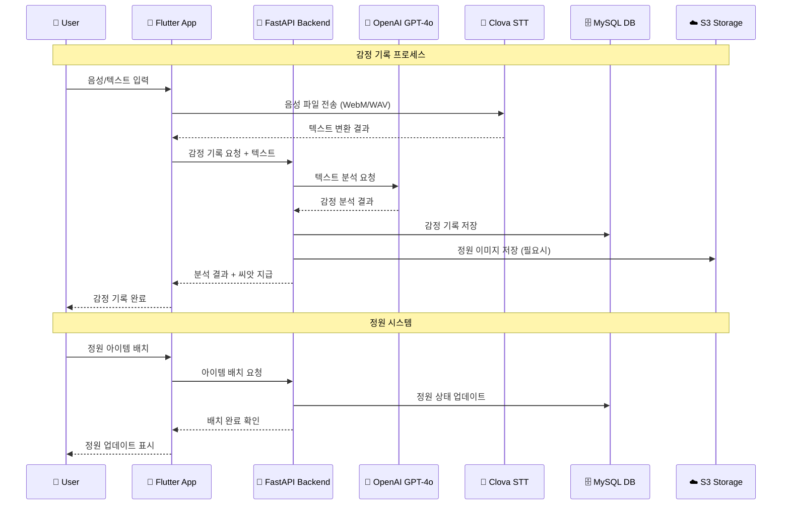

# SimLog (심로그) 🌸

**심리 감정 기록 및 AI 분석 플랫폼 - 완성! 🎉**

감정 표현이 서툰 청년층을 위한 비대면·비실명 감정 기록 및 AI 기반 피드백 시스템

---

## 🚀 주요 기능 (완성! ✅)

### 📝 감정 기록
- **텍스트/음성 입력**: 자유로운 감정 표현
  - **웹/모바일 음성인식**: MediaRecorder API (웹) + record 패키지 (모바일)
  - **Naver Clova STT 연동**: 실시간 음성-텍스트 변환
- **AI 키워드 추출/요약**: GPT-4o mini 기반 자동 분석
- **감정 강도/신뢰도 입력**: 1~10점
- **하루 1회 기록 제한(일반)**
- **일기 작성 시 씨앗 지급**: 감정 기록할 때마다 +2 씨앗

### 🎨 감정 분석
- **감정 분포/통계**: 최근 7/14/30일 감정 분포, 평균 감정색
- **대표 감정색(플루치크 확장 팔레트)**: 8가지 기본 감정 + 인접 2차 감정 조합(사랑, 경외, 실망 등) 중에서 선택, 강도에 따라 명도/채도 반영
- **감정 키워드/요약/색상**: AI가 분석한 결과를 시각적으로 표시
- **주간 요약 캐시**: 일기 저장 즉시 7일 큐 자동 갱신
- **부정 감정 알림**: 1~2주 부정 지속 시 다정한 모달 + 폼 링크
- **공유 링크(7일 만료)**: 최근 7일 요약 스냅샷 공유, 토큰 해시 저장·만료/취소 지원

### 🌱 마음 정원
- **씨앗(화폐) 시스템**: 출석 체크(+2), 일기 작성(+2), 연속 출석 보너스
- **출석 체크**: 매일 출석하여 씨앗 획득, 연속 출석 시 추가 보너스
- **상점 시스템**: 씨앗으로 정원 아이템 구매 (꽃, 화분, 장식)
- **인벤토리 관리**: 구매한 아이템 관리 및 정원 배치, 아이템 판매 기능
- **정원 커스터마이징**: 개인만의 정원 꾸미기, 4단계 레이어링 시스템
- **감정 꽃 시각화**: 기록한 감정을 꽃으로 표현
- **레이어링 시스템**: 배경(0) → 중간(1) → 식물(2) → 동물(3) 순서로 배치
- **조건부 배경색**: 연못 위의 아이템들은 연못색 배경으로 자연스러운 효과

### 👤 사용자 정보 관리
- **닉네임/비밀번호 변경**: 내 정보 수정에서 API 연동으로 즉시 변경
- **반응형 프로필 화면**: 스크롤 지원, 태블릿/모바일 최적화
- **앱 설정/알림 설정/도움말**
- **마음 체크하기**: 효원 상담원 마음체크 안내 및 폼 바로가기, 최근 7일 요약 링크 생성 버튼 제공
- **모달 7일 억제**: 마음체크 수행 시 7일간 모달 미표시
- **Pretendard 폰트 적용**: 전체 앱 기본 폰트로 적용

### 🧭 네비게이션 & UX
- **하단 네비게이션 바**: 텍스트 라벨 제거, 아이콘 확대(가독성 향상)
- **플로팅 +버튼**: 일기 작성 바로가기
- **반응형 디자인**: 화면 크기에 따른 폰트/아이콘 크기 자동 조정
- **향상된 가독성**: 홈화면 폰트 크기 증대, 사용자 경험 개선

---

## 🛠 기술 스택

### Backend
- **FastAPI** (Python)
- **MySQL** + **SQLAlchemy**
- **JWT 인증**
- **OpenAI GPT-4o mini** (AI 분석)
- **NAVER CLOVA** (음성 인식)

### Frontend
- **Flutter** (Dart)
- **모바일/웹/데스크탑 지원**
- **HTTP API 연동**
- **웹 음성인식**: MediaRecorder API, WebM 지원
- **모바일 음성인식**: record 패키지, WAV 지원
- **Pretendard 폰트**: 한국어 최적화 폰트 시스템

---

## 🏗 프로젝트 구조

### 📊 시스템 구성 요소

SimLog는 다음과 같은 시스템 구성으로 되어 있습니다:

#### 🏗️ **아키텍처 레이어**
- **Client Layer**: Flutter 앱 (모바일/웹/데스크탑)
- **API Gateway**: FastAPI 백엔드 (Python + Uvicorn)
- **Data Layer**: MySQL 데이터베이스
- **External APIs**: OpenAI GPT-4o, Naver Clova STT

#### 🔧 **주요 컴포넌트**
- **Frontend**: Flutter 크로스 플랫폼 앱
- **Backend**: FastAPI REST API 서버
- **Database**: MySQL (사용자, 감정기록, 정원시스템)
- **AI Service**: GPT-4o mini 감정 분석
- **Voice Service**: Clova STT 음성인식
- **Storage**: 정원 이미지 및 사용자 에셋

#### 🌐 **네트워크 구성**
- **Public**: API 서버, 웹 앱 접근
- **Private**: 데이터베이스, 내부 서비스
- **External**: OpenAI, Naver Clova API 연동

### 🔄 데이터 흐름도



### 📁 폴더 구조

```
SimLog/
├── backend/                 # FastAPI 백엔드
│   ├── controllers/         # API 엔드포인트
│   ├── models/              # DB 모델
│   ├── services/            # 비즈니스 로직
│   ├── main.py              # 진입점
│   ├── database.py          # 데이터베이스 연결
│   ├── requirements.txt     # 의존성
│   ├── create_developer.py # 개발자 계정 생성
│   ├── add_garden_items.py # 정원 아이템 추가
│   ├── fix_garden_tables.py # 정원 테이블 수정
│   ├── check_items.py       # 아이템 확인
│   ├── seed_dev_user_week.py # 개발용 사용자 데이터
│   ├── dev_seed.py          # 개발용 시드 데이터
│   └── venv/                # Python 가상환경
├── frontend/                # Flutter 프론트엔드
│   ├── lib/                 # Dart 소스 코드
│   │   ├── screens/         # 주요 화면
│   │   └── services/        # API 연동 (음성인식 포함)
│   ├── assets/              # 리소스 파일
│   │   ├── fonts/           # Pretendard 폰트 파일
│   │   └── images/          # 이미지 리소스
│   ├── android/             # Android 플랫폼
│   ├── ios/                 # iOS 플랫폼
│   ├── web/                 # 웹 플랫폼
│   ├── windows/             # Windows 플랫폼
│   ├── macos/               # macOS 플랫폼
│   ├── linux/               # Linux 플랫폼
│   ├── pubspec.yaml         # Flutter 의존성
│   └── analysis_options.yaml # Dart 분석 설정
└── docs/                    # 문서
    ├── 음성인식_설정_가이드.md    # Clova STT 설정 가이드
    ├── 레이어링_시스템_가이드.md  # 정원 레이어링 시스템
    ├── 아키텍쳐/            # 시스템 아키텍처 문서
    └── 개발 계획서/          # 프로젝트 개발 계획서
```

---

## ⚡️ 실행 방법

### 1. 백엔드
```bash
cd backend
pip install -r requirements.txt
# .env 파일 설정 (DB, OPENAI, CLOVA 등)
# CLOVA_CLIENT_ID, CLOVA_CLIENT_SECRET 설정 필수
python database.py          # 데이터베이스 연결 확인
python add_garden_items.py  # 정원 아이템 데이터 추가
python fix_garden_tables.py # 정원 테이블 수정 (필요시)
python create_developer.py  # 개발자 계정 생성
python seed_dev_user_week.py # 개발용 사용자 데이터 (선택사항)
uvicorn main:app --reload
```

### 2. 프론트엔드 (Flutter)
```bash
cd frontend
flutter pub get
# 모바일: flutter run
# 웹 (음성인식 테스트): flutter run -d chrome
# 웹 (포트 지정): flutter run -d chrome --web-port=3000
```

### 3. 음성인식 설정 (선택사항)
- Naver Cloud Platform에서 Clova STT API 키 발급
- `backend/.env` 파일에 `CLOVA_CLIENT_ID`, `CLOVA_CLIENT_SECRET` 설정
- 자세한 설정 방법: `docs/음성인식_설정_가이드.md` 참조

---

## 📱 주요 화면
- **Splash/인트로**: 1초 후 자동 로그인 화면 이동
- **로그인/회원가입**: JWT 인증, 성공 시 홈 이동
- **홈**: 4개 액션 카드(일기 작성, 분석, 정원, 내 정보)
- **분석**: 감정 통계, 분포, 평균 감정색, 최근 기록, 상세보기
- **정원**: 
  - **정원 탭**: 씨앗 표시, 출석 체크, 정원 아이템, 감정 꽃들
  - **상점 탭**: 씨앗으로 아이템 구매 (꽃, 화분, 장식)
  - **인벤토리 탭**: 구매한 아이템 관리 및 정원 배치
- **내 정보**: 프로필, 내 정보 수정(닉네임/비밀번호), 앱/알림/도움말
- **마음 체크하기**: 안내/폼 이동, 최근 7일 요약 링크 생성
- **일기 작성/결과**: 감정 기록 입력, AI 분석 결과 확인

---

## 🎯 프로젝트 완성 현황

### ✅ 모든 핵심 기능 완성! (2025년 기준)

#### 🔐 인증 및 사용자 관리
- [x] JWT 기반 회원가입/로그인/로그아웃
- [x] 프로필 관리 (닉네임/비밀번호 변경)
- [x] 사용자 설정 (앱/알림/도움말)

#### 📝 감정 기록 시스템
- [x] 텍스트/음성 입력 지원
- [x] AI 기반 감정 분석 (GPT-4o mini)
- [x] 감정 강도/신뢰도 입력
- [x] 일일 기록 제한 및 씨앗 지급

#### 🎨 감정 분석 및 시각화
- [x] 감정 분포/통계 (7/14/30일)
- [x] 플루치크 확장 팔레트 기반 대표 감정색
- [x] AI 키워드 추출 및 요약
- [x] 주간 요약 캐시 및 공유 링크

#### 🌱 정원 시스템
- [x] 씨앗(화폐) 시스템
- [x] 출석 체크 및 보너스
- [x] 상점 시스템 (꽃, 화분, 장식)
- [x] 4단계 레이어링 시스템
- [x] 인벤토리 관리 및 커스터마이징

#### 🎤 음성인식 시스템
- [x] 웹 (MediaRecorder API, WebM)
- [x] 모바일 (record 패키지, WAV)
- [x] Naver Clova STT 연동
- [x] 크로스 플랫폼 호환성

#### 🧭 사용자 경험
- [x] 반응형 디자인 (모바일/태블릿/웹)
- [x] Pretendard 폰트 적용
- [x] 직관적인 네비게이션
- [x] 부정 감정 알림 및 모달 억제

#### 🔗 외부 연동
- [x] 효원 상담원 마음체크 폼 연동
- [x] 7일 요약 공유 링크 시스템

---

## 🚀 향후 확장 계획

### 🔮 다음 단계 (선택사항)
- [ ] WebM → WAV 오디오 변환 최적화
- [ ] 음성인식 정확도 개선
- [ ] 상담소 연동/자가진단 확장
- [ ] 다국어 지원
- [ ] 소셜 기능 (친구 추가, 감정 공유)
- [ ] 데이터 백업/복원 시스템

---

## 🤝 기여하기
1. Fork & Branch
2. 기능 개발 후 PR
3. 코드리뷰/병합

---

## 📞 문의
- [프로젝트 깃허브](https://github.com/wlsgur11/SimLog)

---

## 🎉 프로젝트 완성 축하!

**SimLog**는 청년들의 감정 건강을 위한 완전한 솔루션입니다! 🌸

- ✅ **모든 핵심 기능 구현 완료**
- ✅ **크로스 플랫폼 지원**
- ✅ **AI 기반 감정 분석**
- ✅ **게임화된 정원 시스템**
- ✅ **음성인식 지원**
- ✅ **사용자 친화적 UI/UX**

**당신의 감정을 아름답게 기록하고, 마음의 정원을 가꿔보세요! 🌱✨** 