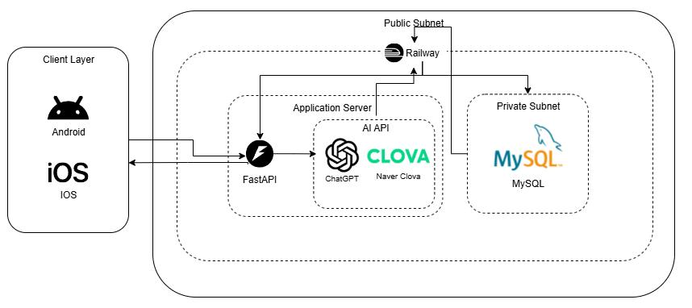

# SimLog (심로그)

**AI가 읽는 마음, 함께 자라는 정원**

**심리 감정 기록 및 AI 분석 플랫폼**

감정 표현이 서툰 청년층을 위한 비대면·비실명 감정 기록 및 AI 기반 피드백 시스템

---

## 1. 프로젝트 소개

### 1.1. 개발배경 및 필요성

**1. 마음 건강 위험군의 높은 비율, 부산대는 43% 이상이 위기 징후**

2023년 전국 국립대 30개 대학 대학생 마음건강 조사 결과, 전국 대학생 중 마음 건강 위기 학생은 18.4%(10,802명)로 나타났습니다. 특히 부산대학교는 위기 징후 학생이 43%로 매우 높은 수준을 보이고 있습니다.

**2. 20대 본인 감정 인식 문제 - 위기징후 상태 학생 상담 유도 필요**

우울증 선별검사에서 양성 판정을 받은 509명을 대상으로 한 설문 결과, 94.0%가 "우울증 진단을 받은 적 없다", 86.8%가 "우울증 진료를 받은 적 없다"고 응답했습니다. 김하나 가톨릭 의대 가정의학과 교수는 "일반인들이 우울증이 있어도 잘 알아차릴 수 없으며 우울감이 있어도 병원 진료를 받지 않는 경우가 많다"고 지적했습니다.

**3. 낮은 교내 상담소 이용률**

부산대학교의 경우 조사에 참여한 학생 1,242명 중 마음건강 서비스를 이용하는 학생은 약 23%인 292명에 그쳤습니다. 여러 가지 시도에도 불구하고 효원상담원의 이용률이 저조한 상황입니다.

SimLog는 이러한 문제들을 해결하기 위해 AI 기술을 활용한 비대면·비실명 감정 기록 및 분석 시스템을 개발했습니다.

**핵심 문제점:**
- **PROBLEM 1: 표현의 장벽** - 내 마음인데, 정작 말로 설명하기 어려울 때
- **PROBLEM 2: 지속의 어려움** - 마음 챙김, 왜 항상 꾸준하기가 힘들까?
- **PROBLEM 3: 보이지 않는 위험** - 나도 모르게 깊어지는 마음의 그늘을 놓칠 때

### 1.2. 개발 목표 및 주요 내용

**주요 목표:**
- AI 기반 감정 분석을 통한 객관적인 마음 건강 상태 파악
- 게이미피케이션을 통한 지속적인 사용 유도
- 부정 감정 지속 시 전문가 상담 연결로 적극적 개입
- 비대면·비실명 환경에서의 안전한 감정 기록

**주요 내용:**
- **AI 감정 분석**: GPT-4o mini 기반 즉시 감정 분석 및 감정 색상으로 직관적 이해
- **마음 정원**: 지루한 마음 건강 관리를 즐거운 습관으로 변화시키는 게임형 시스템
- **위험 신호 알림**: AI가 감정 패턴을 분석하여 위험 신호를 감지하고 전문가 상담 연결

### 1.3. 세부내용

**AI 감정 분석 시스템:**
- OpenAI GPT-4o mini를 활용한 고정밀 감정 분류
- Robert Plutchik의 감정의 바퀴 기반 8가지 기본 감정 분석
- 감정을 색상으로 직관적 표현 (예: 퍼플, 어두운 파랑, 어두운 회색 등)
- 감정 강도 및 신뢰도 점수 제공
- AI 실패 시 키워드 기반 fallback 분석

**마음 정원 시스템:**
- 출석 체크를 통한 씨앗(화폐) 획득
- 정원, 내 씨앗, 상점, 인벤토리 탭으로 구성
- 사용자의 이야기가 새싹의 자양분이 되어 정원이 성장
- 지루한 마음 건강 관리를 즐거운 습관으로 변화

**위험 신호 감지 및 상담 연결:**
- 7일간의 감정 변화 추이 분석
- 지속적 부정 감정 감지 시 "마음이 오랫동안 비를 맞고 있을 때" 알림
- "괜찮아요, 함께 해볼까요?" 메시지와 함께 상담 연결 제안
- 전문가 상담사와의 원활한 소통 지원

### 1.4. 기존 서비스 대비 차별성

**기존 일기 앱과의 차별점:**
- 단순한 텍스트 저장이 아닌 AI 기반 즉시 감정 분석
- 감정을 색상으로 직관적 표현 (퍼플, 어두운 파랑, 어두운 회색 등)
- 지속적 부정 감정 감지 시 적극적 개입
- 마음 정원을 통한 지속적 사용 유도

**기존 상담 서비스와의 차별점:**
- 비대면·비실명 환경에서의 안전한 감정 기록
- AI를 통한 객관적인 감정 상태 파악 및 위험 신호 감지
- 상담사와의 효율적인 정보 공유
- 예방적 마음 건강 관리 및 골든타임 확보

### 1.5. 사회적가치 도입 계획

**현재 단계 (부산대학교):**
- 대학생 대상 마음 건강 관리 서비스
- 효원상담원과의 연계 시스템 구축
- 학내 정신 건강 인식 제고

**핵심 가치와 비전:**
- **데이터 기반의 마음 분석**: AI 감정 분석으로 표현의 장벽을 극복하고, 데이터 기반 위험 신호 조기 감지로 적극적 예방
- **성장하는 마음 정원**: 사용자와 함께 성장하는 정원 시스템으로 외로움 극복, 일기 기록과 보상 연결로 지속적 동기 부여
- **체계적인 건강 관리**: 일상에서 놓치기 쉬운 마음 상태를 체계적으로 점검, 간단하고 재미있는 방식으로 상담에 대한 심리적 부담 감소, 앱 내에서 전문가 상담사와 직접 연결하여 즉시 도움 제공
- **높은 접근성, 확장성**: 검증된 저비용 고효율 마음 건강 관리 솔루션으로 다른 대학, 공공기관, 기업의 유사 문제에도 적용 가능

**향후 확장 방안:**
- **공공기관 연계**: 시청/구청, 보건소, 기업체 등
- **B2B 서비스**: 기관별 맞춤형 마음 건강 관리 솔루션
- **API 서비스**: 다양한 플랫폼과의 연동
- **화이트라벨 솔루션**: 기관별 브랜딩 및 커스터마이징

---

## 2. 상세설계

### 2.1. 시스템 구성도

<div align="center">



</div>

**데이터 흐름도:**
<div align="center">


</div>

**데이터베이스 ERD (Entity Relationship Diagram):**
<div align="center">


</div>

**시스템 구조 흐름도:**
<div align="center">


</div>

### 2.2. 사용 기술

**Backend:**
- **Framework**: FastAPI 0.115.13 (Python 3.8+)
- **Database**: MySQL 8.0 (Railway)
- **ORM**: SQLAlchemy 2.0.0
- **Authentication**: JWT (JSON Web Token)
- **AI Service**: OpenAI GPT-4o mini, Naver Clova STT
- **Deployment**: Railway
- **Package Manager**: pip

**Frontend:**
- **Framework**: Flutter 3.16.5 (Dart 3.2.3)
- **Platform**: Android, iOS, Web
- **State Management**: Flutter 기본 상태 관리
- **HTTP Client**: http package
- **URL Launcher**: url_launcher package
- **Build**: Flutter CLI

**AI & External Services:**
- **Emotion Analysis**: OpenAI GPT-4o mini
- **Speech To Text**: Naver Clova STT
- **Fallback Analysis**: Keyword-based emotion classification
- **Form Service**: Google Forms
- **Cloud Platform**: Railway (Backend + Database)

**Development Tools:**
- **Version Control**: Git
- **API Testing**: Postman
- **Code Editor**: VS Code / Cursor
- **Package Management**: pip (Python), pub (Dart)

---

## 3. 개발결과

### 3.1. 전체시스템 흐름도

**사용자 인증 → 일기 작성 → AI 감정 분석 → 결과 표시 → 마음 건강 모니터링 → 상담 연결**

1. **사용자 인증**: JWT 기반 로그인 및 세션 관리
2. **일기 작성**: 텍스트 기반 일기 입력
3. **AI 감정 분석**: GPT-4o mini를 통한 감정 분류 및 분석
4. **결과 표시**: 감정 색상, 키워드, 요약 제공
5. **마음 건강 모니터링**: 7일 감정 추이 분석
6. **상담 연결**: 지속적 부정 감정 시 전문가 상담 연결

### 3.2. 기능설명

#### 로그인 페이지:
- 이메일 주소와 비밀번호를 입력하면 입력창에서 유효성 검사가 진행됩니다.
- 유효성 검사를 통과하지 못한 경우, 각 경고 문구가 입력창 하단에 표시됩니다.
- 유효성 검사를 통과한 경우, 로그인 버튼이 활성화 됩니다.
- 로그인 버튼을 클릭 시, 입력한 이메일 주소와 비밀번호에 대한 계정이 있는지 확인합니다.
- 계정이 없는 경우, 경고문구가 나타납니다.

#### 일기 작성 페이지:
- "오늘 하루는 어땠나요? SimLog에 당신의 마음을 살짝 남겨주면, 제가 소중하게 간직할게요!" 메시지와 함께 일기 작성
- 수면 품질, 스트레스 정도 등 체크리스트와 함께 텍스트 입력창에 일기 내용 작성
- 작성 완료 버튼을 클릭하면 AI 감정 분석이 시작됩니다.
- 분석 중에는 로딩 화면이 표시됩니다.
- 분석 완료 후 감정 색상, 키워드, 요약이 표시됩니다.

#### 마음 정원 페이지:
- 출석 체크를 통해 씨앗(화폐)을 획득할 수 있습니다.
- 상점에서 다양한 아이템을 구매할 수 있습니다.
- 인벤토리에서 구매한 아이템을 관리할 수 있습니다.
- 정원에 아이템을 배치하여 개인화된 정원을 만들 수 있습니다.

#### 마음 체크 페이지:
- 지속적인 부정 감정 감지 시 "마음이 오랫동안 비를 맞고 있을 때" 알림 표시
- "괜찮아요, 함께 해볼까요?" 메시지와 함께 상담 연결 제안
- "동의 없이 바로가기" 또는 "동의하고 바로가기" 옵션 제공
- 7일 요약 리포트를 생성하여 전문가와 공유할 수 있습니다.
- Google Forms를 통한 상담 신청이 가능합니다.

### 3.3. 기능명세서

프로젝트의 상세한 기능명세서는 다음 링크에서 확인할 수 있습니다:
- **[SimLog 기능명세서](docs/기능명세서.md)** - 상세한 기능 설명 및 API 명세서

### 3.4. 디렉토리 구조

```
SimLog/
├── backend/                 # FastAPI 백엔드
│   ├── controllers/         # API 엔드포인트
│   ├── models/              # DB 모델
│   ├── services/            # 비즈니스 로직
│   ├── main.py              # 진입점
│   ├── database.py          # 데이터베이스 연결
│   ├── requirements.txt     # 의존성
│   └── venv/                # Python 가상환경
├── frontend/                # Flutter 프론트엔드
│   ├── lib/                 # Dart 소스 코드
│   │   ├── screens/         # 주요 화면
│   │   └── services/        # API 연동
│   ├── assets/              # 리소스 파일
│   │   ├── fonts/           # 폰트 파일
│   │   └── images/          # 이미지 리소스
│   ├── android/             # Android 플랫폼
│   ├── ios/                 # iOS 플랫폼
│   ├── web/                 # 웹 플랫폼
│   ├── pubspec.yaml         # Flutter 의존성
│   └── analysis_options.yaml # Dart 분석 설정
└── docs/                    # 문서
    ├── pic/                 # 스크린샷 및 이미지
    ├── 아키텍쳐/            # 시스템 아키텍처 문서
    ├── 개발 계획서/          # 프로젝트 계획서
    └── 발표 자료/            # 프로젝트 발표 자료
```

---

## 4. 설치 및 사용 방법

### 필요한 소프트웨어

**Backend 개발 환경:**
- Python 3.8 이상
- pip (Python 패키지 관리자)
- MySQL 8.0 이상
- Git

**Frontend 개발 환경:**
- Flutter 3.16.5 이상
- Dart 3.2.3 이상
- Android Studio (Android 개발용)
- Xcode (iOS 개발용, macOS만)
- Git

### 설치 방법

#### 1. 백엔드 설치
```bash
# 프로젝트 클론
git clone [repository-url]
cd SimLog/backend

# 가상환경 생성 및 활성화
python -m venv venv
# Windows
venv\Scripts\activate
# macOS/Linux
source venv/bin/activate

# 의존성 설치
pip install -r requirements.txt

# 환경변수 설정 (.env 파일)
# DATABASE_URL, OPENAI_API_KEY, CLOVA_API_KEY 등

# 서버 실행
uvicorn main:app --reload
```

#### 2. 프론트엔드 설치
```bash
cd SimLog/frontend

# Flutter 의존성 설치
flutter pub get

# 개발 서버 실행
# 모바일: flutter run
# 웹: flutter run -d chrome
```

### 실행 방법

1. **백엔드 서버 실행**: `uvicorn main:app --reload`
2. **프론트엔드 실행**: `flutter run`
3. **모바일 앱 테스트**: 실제 기기 또는 에뮬레이터에서 실행
4. **웹 테스트**: 브라우저에서 `http://localhost:3000` 접속

---

## 5. 소개 및 시연 영상

<div align="center">

[](https://youtube.com/shorts/6Zve5oCCCCk?feature=share)

**SimLog 어플 시연 영상** - [YouTube Shorts로 보기](https://youtube.com/shorts/6Zve5oCCCCk?feature=share)

</div>

**프로젝트 소개 동영상**: 교육원 메일(swedu@pusan.ac.kr)로 제출 후 센터에서 부여받은 YouTube URL 주소를 여기에 추가 예정

---

## 6. 팀 소개

### 팀원 구성 및 역할 분담

| 팀원 | 역할 | 담당 영역 | 연락처 |
|------|------|-----------|--------|
| **안나연** | 팀장 | FastAPI 백엔드, AI 서비스 연동, 데이터베이스 설계 | [octopus121@pusan.ac.kr](mailto:octopus121@pusan.ac.kr) |
| **김율겸** | Frontend 개발 | Flutter 앱 개발, UI/UX 구현 | [octopus121@pusan.ac.kr](mailto:octopus121@pusan.ac.kr) |
| **문진혁**  | 앱 backend, frontend 개발 | 감정 분석 알고리즘, AI 모델 최적화 | [octopus121@pusan.ac.kr](mailto:octopus121@pusan.ac.kr) |
| **황연경** | 디자인 | 앱 디자인, 마음 정원 에셋 제작 | [octopus121@pusan.ac.kr](mailto:octopus121@pusan.ac.kr) |

### 팀 소개

**몽글몽글 스튜디오**는 AI 기술을 활용하여 사용자의 마음 건강을 돕는 혁신적인 모바일 애플리케이션을 개발하는 팀입니다. 

**팀 구성:**
- **안나연**: 팀장
- **김율겸**: 기획, 자료 조사
- **문진혁**: 개발
- **황연경**: 기획

각 팀원의 전문성을 바탕으로 사용자 중심의 서비스를 제공하고, 지속적인 개선과 확장을 통해 더 많은 사람들에게 도움을 주고자 합니다.

---

## 7. 해커톤 참여 후기

### 안나연 (팀장, 기획)
[팀원별 해커톤 참여 후기를 작성해주세요]

### 김율겸 (기획, 자료 조사)
[팀원별 해커톤 참여 후기를 작성해주세요]

### 문진혁 (개발)
해커톤을 통해 AI 기술을 활용한 실제 서비스를 개발할 수 있어 매우 의미 있는 경험이었습니다. 특히 웹이 아닌 앱을 처음부터 끝까지 만들어 봤다는게 뿌듯했습니다. 실제 사용자에게 도움이 되는 서비스를 만들 수 있어 보람찼습니다.

### 황연경 (기획)
[팀원별 해커톤 참여 후기를 작성해주세요]

---

## 앱 스크린샷

### 로그인 및 홈 화면
<div align="center">


</div>

### 일기 작성 및 감정 분석
<div align="center">


</div>

### 마음 정원 시스템
<div align="center">


</div>

### 마음 건강 관리
<div align="center">


</div>

---

## 향후 발전 방향

### 기능 확장
- **감정 패턴 분석**: 장기간 감정 변화 추이
- **맞춤형 상담**: AI 기반 개인화된 상담 제안
- **커뮤니티**: 비슷한 상황의 사용자들과 소통
- **전문가 매칭**: 상담사와의 1:1 연결

### 기술 개선
- **실시간 분석**: 실시간 감정 상태 모니터링
- **음성 인식**: 음성으로 일기 작성 지원
- **이미지 분석**: 사진을 통한 감정 상태 파악
- **머신러닝**: 사용자별 맞춤형 감정 분석 모델

### 확장성 및 기관 연계
- **공공기관 연계**: 시청/구청, 보건소, 기업체 등
- **B2B 서비스**: 기관별 맞춤형 마음 건강 관리 솔루션
- **API 서비스**: 다양한 플랫폼과의 연동
- **화이트라벨 솔루션**: 기관별 브랜딩 및 커스터마이징

---

## 📞 문의

<div>

| [문진혁](https://github.com/wlsgur11) |
| :------------------------------------: |
|  |
| [octopus121@pusan.ac.kr](mailto:octopus121@pusan.ac.kr) |

</div>

---

*SimLog는 AI가 몰랐던 내 마음을 읽어주는 혁신적인 모바일 애플리케이션입니다. 부산대학교 학생의 마음 건강을 지켜주는 혁신적 솔루션으로, 현재는 부산대학교를 시작으로, 향후 다양한 기관과의 연계를 통해 더 많은 사람들에게 마음 건강 관리 서비스를 제공할 예정입니다.*
