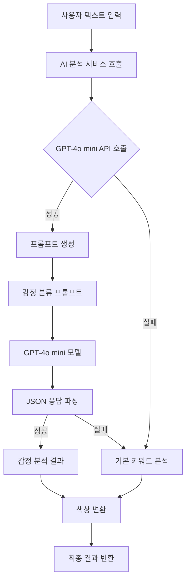

# GPT 모델 감정 분류 프로세스

## 전체 프로세스 플로우



## 상세 프로세스 설명

### 1. 입력 단계
- **사용자 텍스트**: 감정 기록 텍스트
- **API 키 검증**: OpenAI API 키 확인

### 2. 프롬프트 생성 단계
```
감정 분류 프롬프트:
- 로버트 플루치크의 감정의 바퀴 8가지 감정 정의
- 분석할 텍스트 제공
- JSON 응답 형식 지정
```

### 3. GPT-4o mini 모델 처리 단계
```
모델 파라미터:
- model: "gpt-4o-mini"
- temperature: 0.3 (일관성 있는 결과)
- max_tokens: 제한 없음
```

### 4. 감정 분류 과정
```
GPT 모델 내부 프로세스:
1. 텍스트 토큰화
2. 문맥 이해 및 감정 키워드 추출
3. 8가지 감정 카테고리 매칭
4. 감정 강도 평가 (1-10)
5. 분석 확신도 계산 (0.0-1.0)
6. 분석 근거 생성
```

### 5. 응답 처리 단계
```
JSON 응답 구조:
{
    "primary_emotion": "감정명",
    "intensity": 1-10,
    "confidence": 0.0-1.0,
    "reasoning": "분석 근거"
}
```

### 6. 색상 변환 단계
```
색상 매핑:
- 감정 → 기본 색상 (파스텔 톤)
- 강도 → 색상 밝기 조정
- 최종 색상 정보 생성
```

## 감정의 바퀴 8가지 감정

| 감정 | 색상 | HEX | 설명 |
|------|------|-----|------|
| 기쁨 | 파스텔 옐로우 | #FFE5B4 | 밝고 따뜻한 기쁨의 색 |
| 신뢰 | 파스텔 그린 | #B8E6B8 | 안정감과 신뢰를 나타내는 색 |
| 두려움 | 파스텔 그레이 | #D3D3D3 | 불안과 두려움을 나타내는 색 |
| 놀람 | 파스텔 오렌지 | #FFD4B3 | 예상치 못한 놀람을 나타내는 색 |
| 슬픔 | 파스텔 블루 | #B3D9FF | 차분하고 슬픈 감정을 나타내는 색 |
| 혐오 | 파스텔 브라운 | #D4C4A8 | 불쾌감과 혐오를 나타내는 색 |
| 분노 | 파스텔 레드 | #FFB3B3 | 강렬한 분노를 나타내는 색 |
| 기대 | 파스텔 퍼플 | #E6B3E6 | 희망과 기대를 나타내는 색 |

## 강도별 색상 변화

| 강도 | 설명 | 밝기 조정 |
|------|------|-----------|
| 1-3 | 매우 연함 ~ 약간 연함 | 0.8-0.9 |
| 4-6 | 보통 | 0.65-0.75 |
| 7-9 | 약간 진함 ~ 매우 진함 | 0.5-0.6 |
| 10 | 최대 | 0.45 |

## 에러 처리 및 폴백

1. **API 키 없음**: 기본 키워드 분석으로 전환
2. **API 호출 실패**: 기본 키워드 분석으로 전환
3. **JSON 파싱 실패**: 기본 키워드 분석으로 전환
4. **모델 응답 오류**: 기본 키워드 분석으로 전환

## 성능 최적화

- **Temperature 0.3**: 일관성 있는 결과 보장
- **프롬프트 최적화**: 명확한 지시사항과 예시 제공
- **에러 핸들링**: 안정적인 폴백 메커니즘
- **응답 검증**: JSON 형식 및 데이터 유효성 검사